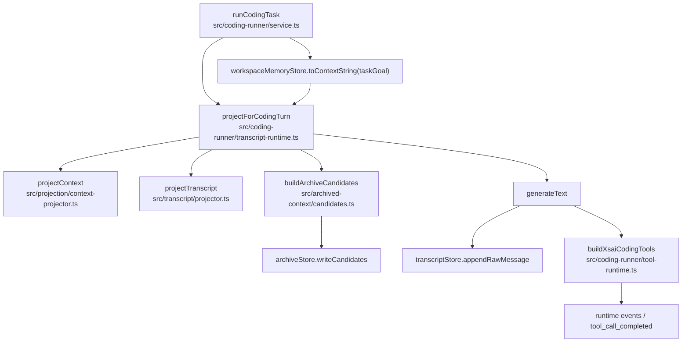
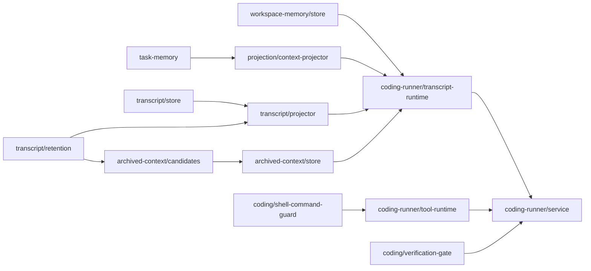

# Coding Agent Code Index

This is an agent-facing code navigation index for the coding context and memory
code in `services/computer-use-mcp`.

It is not a truth source, not a generated code graph, and not a long-term memory
system. Use it to decide what to read first. If this file disagrees with
implementation, tests, package scripts, or `src/support-matrix.ts`, the code and
tests win.

## Non-Goals

- no runtime behavior changes
- no schema changes
- no new retrieval behavior
- no automatic memory promotion
- no code-generated graph
- no claim that the coding memory system is complete
- no replacement for direct code/test inspection

## Concept Index

| Concept | Primary files | Tests | Notes |
|---|---|---|---|
| Coding runner loop | `src/coding-runner/service.ts`, `src/coding-runner/types.ts`, `src/coding-runner/config.ts` | `src/coding-runner/coding-runner.test.ts` | Owns turn loop, tool calls, report handling, correction turns, and final status. |
| Coding runner context assembly | `src/coding-runner/transcript-runtime.ts`, `src/coding-runner/context-policy.ts` | `src/coding-runner/transcript-runtime.test.ts`, `src/coding-runner/context-policy.test.ts` | Combines trace, task memory, workspace context, transcript projection, and archive candidates before model call. |
| Task Memory | `src/task-memory/types.ts`, `src/task-memory/manager.ts`, `src/task-memory/merge.ts`, `src/coding-runner/memory.ts` | `src/task-memory/task-memory.test.ts`, `src/coding-runner/memory.test.ts` | Current-run recovery state only. Not long-term memory. |
| Transcript truth source | `src/transcript/store.ts`, `src/transcript/types.ts` | `src/transcript/transcript.test.ts` | Append-only LLM message truth source. |
| Transcript projection | `src/transcript/projector.ts`, `src/transcript/retention.ts`, `src/transcript/block-parser.ts`, `src/transcript/compactor.ts` | `src/transcript/retention.test.ts`, `src/transcript/transcript.test.ts` | Disposable prompt projection from append-only transcript entries. |
| Run Evidence Archive | `src/archived-context/candidates.ts`, `src/archived-context/store.ts`, `src/archived-context/serializer.ts`, `src/archived-context/types.ts` | `src/archived-context/archived-context.test.ts` | Current-run historical evidence. Search-before-read and latest-search-only. |
| Workspace Memory Adapter | `src/workspace-memory/store.ts`, `src/workspace-memory/review-request-store.ts`, `src/workspace-memory/types.ts` | `src/workspace-memory/workspace-memory.test.ts`, `src/workspace-memory/review-request-store.test.ts` | Governed local adapter and future `plast-mem` bridge. Not AIRI long-term memory. |
| Workspace memory MCP surface | `src/server/register-workspace-memory.ts`, `src/server/tool-descriptors/workspace-memory.ts` | `src/server/register-workspace-memory.test.ts`, `src/server/register-tool-search.test.ts` | External request/apply/read surfaces. Apply/reject require explicit gate. |
| Workspace memory CLI | `src/bin/workspace-memory-review.ts`, `src/bin/smoke-workspace-memory-review.ts` | `src/bin/workspace-memory-review.test.ts` | Local operator workflow over the same append-only stores, including reviewed plast-mem bridge record export. |
| Plast-Mem bridge export | `coding-plast-mem-bridge-contract.md`, `src/workspace-memory/exporters/plast-mem.ts`, `src/workspace-memory/types.ts` | `src/workspace-memory/exporters/plast-mem.test.ts` | Pure serializer for active human-verified workspace memory. No runtime integration yet. |
| Coding primitives and proof gates | `src/coding/primitives.ts`, `src/coding/verification-gate.ts`, `src/coding/shell-command-guard.ts`, `src/coding/report-completion-evidence.ts` | `src/coding/primitives.test.ts`, `src/coding/verification-gate.test.ts`, `src/coding/shell-command-guard.test.ts` | Defines coding operations, validation proof, report evidence, and shell misuse constraints. |
| Live failure replay | `src/coding-runner/live-failure-replay.ts`, `src/coding-runner/live-failure-corpus.ts`, `src/bin/coding-eval-replay.ts` | `src/coding-runner/live-failure-replay.test.ts`, `src/coding-runner/live-failure-corpus.test.ts`, `src/bin/coding-eval-replay.test.ts` | Maps live provider failures into deterministic replay/classification. |

Failure replay contract:

- `coding-failure-replay-contract.md`

Evidence pin contract:

- `coding-evidence-pin-contract.md`

Plast-Mem bridge contract:

- `coding-plast-mem-bridge-contract.md`

## Runner Context Call Flow

Do not modify this flow unless the task explicitly targets coding context
projection or runner turn assembly.

Key rules:

- Transcript store remains append-only.
- Projection is disposable request assembly.
- Archive candidates come from compacted/dropped transcript material.
- Workspace memory context is active-only by default.
- Task memory enters as pinned runtime data, not instruction authority.

## File Relationship Graph

Shared retention policy lives in `src/transcript/retention.ts`. Do not duplicate
retention constants in archive or runner code.

## Ownership Boundaries

### Task Memory Owns

- current-run recovery state
- recent failure reason
- evidence pins
- budget pressure
- completion criteria reminders

### Task Memory Must Not Own

- long-term project facts
- archive summaries
- workspace memory promotion
- durable coding rules
- provider-specific prompt hacks

### Transcript Owns

- append-only LLM message history
- raw assistant/tool messages
- durable transcript entries for projection

### Transcript Must Not Own

- current task status
- workspace memory activation
- archive search policy
- verification gate decisions

### Run Evidence Archive Owns

- compacted/dropped current-run historical evidence
- search-before-read current-run recall
- bounded archived artifact reads
- historical evidence labeling

### Run Evidence Archive Must Not Own

- cross-run memory
- workspace memory activation
- automatic replay into every prompt
- file-system browsing for the model
- instruction authority

### Workspace Memory Adapter Owns

- governed local coding context
- proposed/active/rejected lifecycle
- review request/apply/reject records
- future `plast-mem` bridge boundary

### Workspace Memory Adapter Must Not Own

- raw archive dumps
- automatic promotion
- task-local failure state
- semantic/vector retrieval
- AIRI project-level long-term memory

### Verification Gate Owns

- whether a reported completion is acceptable
- mutation proof checks
- report-only proof checks
- validation command evidence checks

### Verification Gate Must Not Own

- memory retrieval
- transcript projection
- task-memory mutation
- provider retry policy

## Invariant Index

### Transcript

- append-only truth source
- projection is disposable
- compacted history is not system instruction
- no orphan tool results
- raw transcript preservation matters for provider compatibility

### Task Memory

- current-run only
- runtime data, not executable instructions
- evidence pins are bounded recovery anchors
- evidence pin prefixes and non-pin recovery boundaries are documented in
  `coding-evidence-pin-contract.md`
- cannot override tool results, user instructions, or verification gates
- cannot promote itself into workspace memory

### Run Evidence Archive

- current-run only
- search-before-read
- latest-search-only read allowlist
- zero-hit search clears allowlist
- read content is `historical_evidence_not_instructions`
- recall denial is a valid guardrail

### Workspace Memory Adapter

- only active entries enter default prompt context
- proposed and rejected entries do not enter default prompt context
- model can propose, not activate
- apply/reject requires external governance
- local adapter must not grow into a second long-term memory system
- future `plast-mem` export is contract-only until serialization/export tests
  exist

### Coding Runner

- text-only final is not completion
- report completion still passes through verification gate
- correction turns must stay bounded
- unavailable tool requests are tool-adherence failures, not hidden success
- workspace cwd matters for validation recovery

### Failure Replay

- same input produces the same replay row
- normalizer must not mutate runner result or event inputs
- completed eval results do not produce failure rows
- source provider/model/log metadata is evidence, not classification authority
- unknown failures route to deterministic replay before runtime changes

## Test Map

| If touching | Run |
|---|---|
| `src/task-memory/*` or `src/coding-runner/memory.ts` | `pnpm -F @proj-airi/computer-use-mcp exec vitest run src/task-memory/task-memory.test.ts src/coding-runner/memory.test.ts` |
| `src/transcript/*` | `pnpm -F @proj-airi/computer-use-mcp exec vitest run src/transcript/retention.test.ts src/transcript/transcript.test.ts` |
| `src/archived-context/*` | `pnpm -F @proj-airi/computer-use-mcp exec vitest run src/archived-context/archived-context.test.ts` |
| `src/workspace-memory/*` | `pnpm -F @proj-airi/computer-use-mcp exec vitest run src/workspace-memory/workspace-memory.test.ts src/workspace-memory/review-request-store.test.ts src/server/register-workspace-memory.test.ts` |
| `src/bin/workspace-memory-review.ts` | `pnpm -F @proj-airi/computer-use-mcp exec vitest run src/bin/workspace-memory-review.test.ts src/workspace-memory/workspace-memory.test.ts src/workspace-memory/review-request-store.test.ts` |
| `src/workspace-memory/exporters/plast-mem.ts` | `pnpm -F @proj-airi/computer-use-mcp exec vitest run src/workspace-memory/exporters/plast-mem.test.ts src/workspace-memory/workspace-memory.test.ts src/workspace-memory/review-request-store.test.ts` |
| `src/coding-runner/transcript-runtime.ts` or `src/coding-runner/context-policy.ts` | `pnpm -F @proj-airi/computer-use-mcp exec vitest run src/coding-runner/transcript-runtime.test.ts src/coding-runner/context-policy.test.ts src/coding-runner/coding-runner.test.ts` |
| `src/coding-runner/service.ts` | `pnpm -F @proj-airi/computer-use-mcp exec vitest run src/coding-runner/coding-runner.test.ts` |
| `src/coding-runner/tool-runtime.ts` | `pnpm -F @proj-airi/computer-use-mcp exec vitest run src/coding-runner/coding-runner.test.ts src/server/register-tools-coding-runner.test.ts` |
| `src/coding/verification-gate.ts` | `pnpm -F @proj-airi/computer-use-mcp exec vitest run src/coding/verification-gate.test.ts src/coding-runner/coding-runner.test.ts` |
| `src/coding/shell-command-guard.ts` | `pnpm -F @proj-airi/computer-use-mcp exec vitest run src/coding/shell-command-guard.test.ts src/coding-runner/coding-runner.test.ts` |
| live failure replay files | `pnpm -F @proj-airi/computer-use-mcp exec vitest run src/coding-runner/live-failure-replay.test.ts src/coding-runner/live-failure-corpus.test.ts src/bin/coding-eval-replay.test.ts` |
| shared coding memory docs only | `git diff --check` |

Always add `pnpm -F @proj-airi/computer-use-mcp typecheck` when runtime
contracts or exported types changed.

## Failure Routing

| Symptom | First files to inspect | Do not start with |
|---|---|---|
| `TEXT_ONLY_FINAL` | `src/coding-runner/service.ts`, `src/coding-runner/memory.ts`, `src/coding-runner/coding-runner.test.ts` | workspace memory |
| `ARCHIVE_RECALL_DENIED` after guessed artifact id | `src/coding-runner/tool-runtime.ts`, `src/archived-context/store.ts`, `src/archived-context/archived-context.test.ts` | transcript retention |
| archive read allowed after zero-hit search | `src/coding-runner/tool-runtime.ts`, `src/archived-context/store.ts` | task memory |
| proposed memory appears in prompt | `src/workspace-memory/store.ts`, `src/coding-runner/transcript-runtime.ts`, `src/server/register-workspace-memory.test.ts` | archive context |
| active memory missing from prompt | `src/workspace-memory/store.ts`, `src/coding-runner/service.ts`, `src/coding-runner/transcript-runtime.ts` | archive store |
| orphan tool result or provider message error | `src/transcript/projector.ts`, `src/transcript/store.ts`, `src/transcript/retention.ts` | workspace memory |
| compacted block acts like system instruction | `src/transcript/projector.ts`, `src/projection/context-projector.ts` | workspace memory |
| completed report rejected despite no mutation task | `src/coding/verification-gate.ts`, `src/coding/report-completion-evidence.ts`, `src/coding/verification-gate.test.ts` | archive store |
| validation command runs outside workspace | `src/coding-runner/tool-runtime.ts`, `src/coding-runner/service.ts`, `src/coding-runner/live-failure-replay.ts` | workspace memory |
| model asks for unavailable `Bash` after denial | `src/coding-runner/memory.ts`, `src/bin/e2e-coding-governor-xsai-soak.test.ts` | adding shell tools |
| eval replay reports a completed run as failure | `src/coding-runner/live-failure-replay.ts`, `src/bin/coding-eval-report.test.ts` | runner service |

## Agent Editing Rules

- Read the concept row first, then inspect the listed primary files and tests.
- Keep changes in one ownership boundary unless the task explicitly spans more.
- If a fix needs a second ownership boundary, split the follow-up or explain why
  the boundary crossing is necessary.
- Do not treat this markdown index as proof that code behaves a certain way.
- Do not add code just because a diagram or table here is incomplete.
- Update this index only when a stable file relationship, invariant, or routing
  rule changes.
