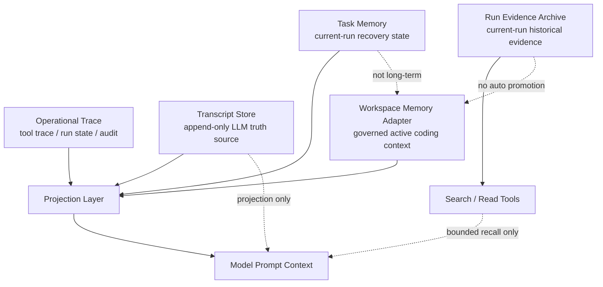
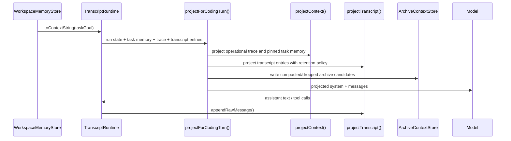
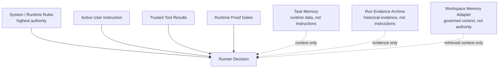
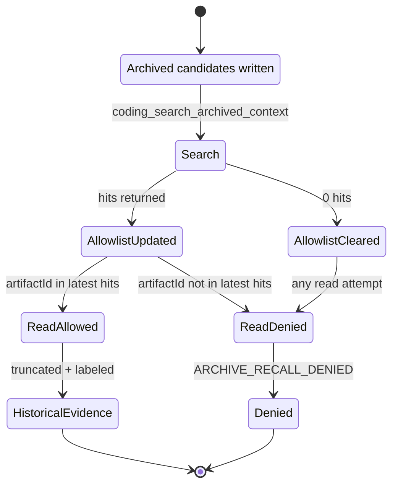
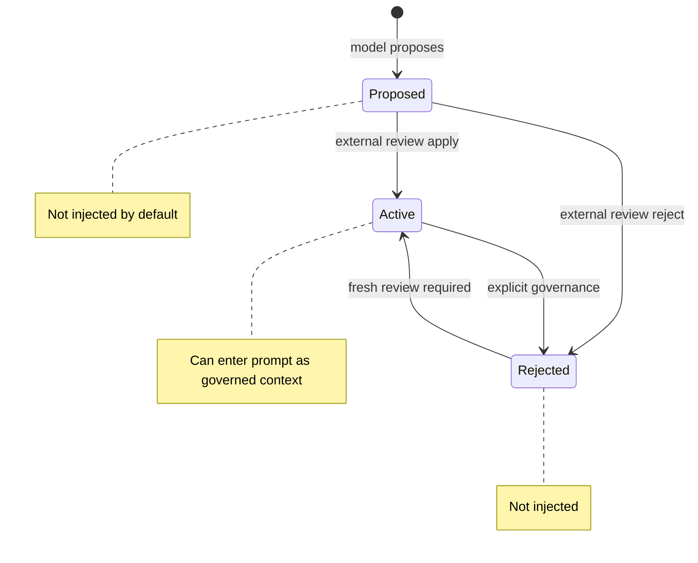

# Context Memory Diagram Index

This document is a visual index for the `computer-use-mcp` context and coding
memory substrate.

It is not a new architecture proposal and does not define new runtime behavior.
It exists to make the current layer boundaries easier to review without turning
`computer-use-mcp` into AIRI's project-level long-term memory system.

## Purpose

Use this file when you need to answer:

- which context sources feed the coding runner prompt
- which stores are truth sources and which are projections
- what can influence runner decisions versus what can only provide evidence
- why archive recall is current-run-only
- why workspace memory is a governed adapter, not `plast-mem`

Read this together with:

- `context-memory-engineering.md`
- `coding-context-memory-substrate-audit.md`
- `coding-memory-construction-plan.md`

## Non-Goals

- no runtime behavior changes
- no MCP schema changes
- no workspace memory auto-activation
- no archive-to-workspace promotion
- no vector, BM25, hybrid, or RRF retrieval
- no GUI or CLI changes
- no claim that AIRI project-level memory is complete

## Diagram 1: Layer Map

Projection feeds the model. Truth sources remain separate.

Related source:

- `src/projection/context-projector.ts`
- `src/coding-runner/transcript-runtime.ts`
- `src/transcript/*`
- `src/task-memory/*`
- `src/archived-context/*`
- `src/workspace-memory/*`

## Diagram 2: Runner Turn Context Flow

Transcript entries are not deleted by projection. The model receives a bounded
projection, while append-only stores keep the underlying evidence.

Related source:

- `src/coding-runner/transcript-runtime.ts`
- `src/coding-runner/context-policy.ts`
- `src/transcript/projector.ts`
- `src/transcript/retention.ts`
- `src/archived-context/candidates.ts`

## Diagram 3: Prompt Trust Boundary

Memory can inform the runner. It cannot override active user instruction, trusted
tool results, or verification gates.

Related source:

- `src/task-memory/manager.ts`
- `src/archived-context/types.ts`
- `src/coding/verification-gate.ts`
- `src/coding-runner/tool-runtime.ts`
- `src/workspace-memory/types.ts`

## Diagram 4: Archive Recall Flow

Archive recall is current-run-only and search-before-read. It is not folder
browsing and not long-term memory.

Related source:

- `src/archived-context/store.ts`
- `src/archived-context/serializer.ts`
- `src/coding-runner/tool-runtime.ts`
- `src/archived-context/archived-context.test.ts`

## Diagram 5: Workspace Memory Adapter Governance

The model can propose memory. It cannot activate memory.

Related source:

- `src/workspace-memory/store.ts`
- `src/workspace-memory/review-request-store.ts`
- `src/server/register-workspace-memory.ts`
- `src/bin/workspace-memory-review.ts`
- `src/workspace-memory/workspace-memory.test.ts`
- `src/workspace-memory/review-request-store.test.ts`

## Boundary Summary

- Operational trace is execution/audit state.
- Transcript store is append-only LLM truth.
- Task Memory is current-run recovery state.
- Run Evidence Archive is current-run historical evidence.
- Workspace Memory Adapter is local governed context and future `plast-mem`
  bridge.
- Project-level long-term memory belongs to `plast-mem`, not this package.

