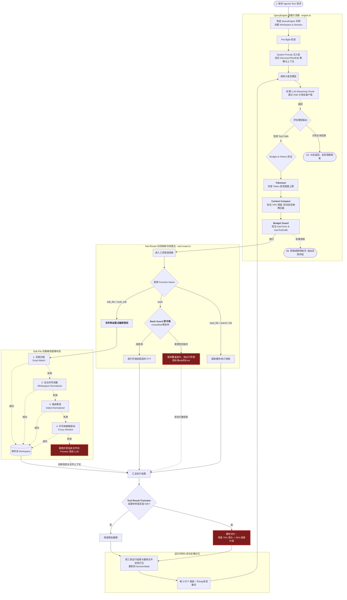

这是一份**极其详细的模块级别架构与数据流向表**。我把黑盒拆开了，重点呈现了 **QueryEngine 的内部 ReAct 大循环时序**、**Tool Router 的阶梯退避策略** 以及 **安全网在中间件层的拦截细节**。

这份图能帮助你理解任何由于“大模型乱改文件”或“死循环”导致的问题，到底在哪里被强行踩了刹车：

### 进一步研读这套图表的 3 个核心细节：

1. **ReAct 引擎的安全钳制（左上角 `QueryEngine` 区）**
   - 这里的设计摒弃了将 Agent 全权托付给 LLM 自由跳舞的做法。**在向工具路由器派发前，每一轮动作都横切了一道 `Tokenizer -> Context Compact -> Budget Guard` 的安检长廊**。 
   - 由于大语言模型在长期修改文件后易发生 “上下文 Token 大爆炸” 以致于陷入死机或拖死 API Budget，这里的 `Context Compact` 会在预算水位抵达 70% 时暴力剔除中间记忆进行摘要压缩。

2. **为什么不让模型直接敲 Bash 编辑代码？（中间 `Tool Router` 区）**
   - 很多早期的 Coding Agent 会赋予大模型完全的终端读写权限。由于模型缺乏精准光标认知，极其容易写出如 `echo > file` 或胡乱 `sed` 而引发灾难。
   - `Tool Router` 在收到 `bash` 命令时，中间设有一个 `BashGuard` 探针屏障：只要正则解析到危险修改模式，**请求根本下不到终端**，引擎会伪造一段真实的终端报错信息（"Error: Do not use bash for edits. Please use edit_file"）骗大模型利用专门的编辑器链进行修改。

3. **阶梯降级编辑瀑布流（右侧 `Edit File` 区）**
   - 当大模型想利用 `edit_file` 修改局部代码块时，大模型经常会由于幻觉，在缩进数量或空行数上写出一部分差异。如果要求严格全匹配（Exact），往往会连续发生 "target string not found" 死链。
   - 这条编辑管线像个漏斗，一级比一级贪婪。如果完美匹配不到，会逐级清除两端的空白字符，如果不成则重新排列首行缩进（Indent Normalized）。当模型因为代码产生过多缩进而卡住时，这个重试引擎总能兜底找到正确编辑缝隙。如果全挂了，则把原文件相关的 Chunk 截出来吐回给大模型。

